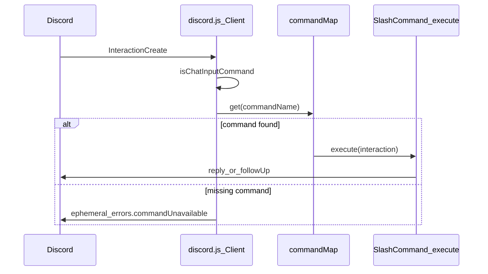

# fernn — project overview (for contributors & LLMs)

**fernn** is a [Discord](https://discord.com/) **slash-command bot** (chat input interactions only). It is written in **TypeScript**, runs on **Bun**, and uses **discord.js** v14.

For local setup (install, env vars, scripts, Docker), see the [README](../README.md).

---

## Tech stack

| Layer | Choice |
|--------|--------|
| Language | TypeScript (`strict`, `moduleResolution: "bundler"`, `allowImportingTsExtensions`, `verbatimModuleSyntax`, `noEmit` — see [`tsconfig.json`](../tsconfig.json)) |
| Runtime / PM | [Bun](https://bun.sh/) — ESM (`"type": "module"` in [`package.json`](../package.json)) |
| Discord API | [discord.js](https://discord.js.org/) ^14 (REST v10 for command registration) |
| i18n | [i18next](https://www.i18next.com/) |
| CLI styling | [chalk](https://github.com/chalk/chalk) |

Main npm scripts: `start`, `start:all` (deploy commands then start), `dev`, `deploy:commands`, `typecheck`.

---

## Entry points

| File | Role |
|------|------|
| [`index.ts`](../index.ts) (repo root) | Re-exports `./src/index.ts` — keeps Docker and tooling entry stable. |
| [`src/index.ts`](../src/index.ts) | Bot process: `Client`, `InteractionCreate`, i18n init, `client.login`. |
| [`src/deploy-commands.ts`](../src/deploy-commands.ts) | Registers slash commands with Discord (guild vs global — see config). |

---

## Runtime flow (slash commands)



- **Intents** (in [`src/index.ts`](../src/index.ts)): `GatewayIntentBits.Guilds` only. Add more intents in that file if you need messages, members, voice, etc.
- **Errors**: Unhandled errors in `execute` are caught in [`src/index.ts`](../src/index.ts); the user sees a translated ephemeral `errors.commandExecutionFailed`.

---

## Configuration & environment

[`src/config.ts`](../src/config.ts) reads:

| Variable | Required | Effect |
|----------|----------|--------|
| `DISCORD_TOKEN` | yes | Bot token for login and REST. |
| `DISCORD_CLIENT_ID` | yes | Application ID for command routes. |
| `DISCORD_GUILD_ID` | no | If set, commands deploy to **that guild** only (fast iteration). If unset, deploy is **global** (`deployGlobally: !guildId`). |

Template: [`.env.example`](../.env.example). Bun loads `.env` automatically (no `dotenv` package).

---

## Repository layout

```text
fernn/
  index.ts                 # → ./src/index.ts
  package.json
  tsconfig.json
  flags.json               # Static permission-flag label pairs (e.g. user-facing strings)
  Dockerfile
  .env.example
  docs/
    PROJECT_OVERVIEW.md    # this file
  src/
    index.ts               # Bot bootstrap
    deploy-commands.ts       # Slash command registration script
    config.ts              # Env + deploy scope
    types/
      command.ts           # SlashCommand interface
    commands/
      index.ts             # commands[], commandMap, commandData — register new commands here
      general/             # e.g. ping, uptime
      moderation/
        guards.ts          # Shared guild/moderation helpers
        ban/, kick/, mute/, clear/
      utility/
        serverInfo/, userInfo/   # userInfo may include utils/ subfolder
    i18n/
      index.ts
      locales/
        en/common.json
        es/common.json
        pt-BR/common.json
    utils/
      defaultEmbed.ts
      interactionLog.ts
```

### Important files

- **[`src/commands/index.ts`](../src/commands/index.ts)** — Imports every command module, builds `commandMap` keyed by `command.data.name`, and `commandData` for REST `PUT`. **New slash commands must be imported and appended to `commands[]` here.**
- **[`src/types/command.ts`](../src/types/command.ts)** — `SlashCommand`: `{ data: SlashCommandBuilder | …, execute(interaction) }`.
- **[`src/commands/moderation/guards.ts`](../src/commands/moderation/guards.ts)** — `replyIfNotInGuild`, `resolveMember`, `ensureModerationTarget`, etc.
- **[`src/i18n/index.ts`](../src/i18n/index.ts)** — `initializeI18n()`, `getTranslator(locale)`, `resolveLocale`. Single namespace **`common`**; locales `en`, `es`, `pt-BR`.
- **[`src/utils/defaultEmbed.ts`](../src/utils/defaultEmbed.ts)** — Shared embed styling.
- **[`src/utils/interactionLog.ts`](../src/utils/interactionLog.ts)** — Console success/failure logs for slash commands (chalk).
- **[`flags.json`](../flags.json)** — Not loaded by core bootstrap; used by features that need permission-flag labels (e.g. utility commands).

---

## Conventions

- **Command modules**: Export a single command object named `*Command` (e.g. `pingCommand`, `userInfoCommand`) from each command folder’s `index.ts`.
- **Imports**: Use explicit `.ts` extensions in import paths (project style).
- **Slash names**: Set with `SlashCommandBuilder` / `.setName("lowercase")` — these are the Discord slash identifiers and `commandMap` keys.
- **User-facing strings**: Prefer **i18n** via `getTranslator(interaction.locale)` and keys under `errors.*` and `commands.*` in each locale’s `common.json` (see [`src/i18n/locales/en/common.json`](../src/i18n/locales/en/common.json)).
- **Command-specific helpers**: Optional `utils/` under a command directory; file names are mostly **camelCase** `.ts`; static JSON assets may use **kebab-case** (e.g. `user-badge-flags.json`).

---

## Docker

[`Dockerfile`](../Dockerfile): multi-stage **oven/bun** image, production `bun install`, copies `index.ts`, `src/`, lockfile and config; runs as user `bun`; default command is `bun run start` (not `start:all`). To register commands from a container, run `bun run deploy:commands` as in the README.

---

## Agent / editor context (Cursor)

- **discord.js**: Follow [`.cursor/rules/discord-js-official-docs.mdc`](../.cursor/rules/discord-js-official-docs.mdc) and [`.cursor/skills/discord-js-docs/SKILL.md`](../.cursor/skills/discord-js-docs/SKILL.md) (official docs first; match repo `discord.js` version).
- **Bun**: Prefer Bun over Node/npm/pnpm for install/run — [`.cursor/rules/use-bun-instead-of-node-vite-npm-pnpm.mdc`](../.cursor/rules/use-bun-instead-of-node-vite-npm-pnpm.mdc).

---

## Adding a new slash command (checklist)

1. Create `src/commands/<category>/<name>/index.ts` exporting `*Command` with `data` + `execute`.
2. Add strings to **all** locale files under `src/i18n/locales/*/common.json` as needed.
3. Import and register the command in [`src/commands/index.ts`](../src/commands/index.ts).
4. Run `bun run deploy:commands` (or `bun run start:all`) so Discord has the definition.
